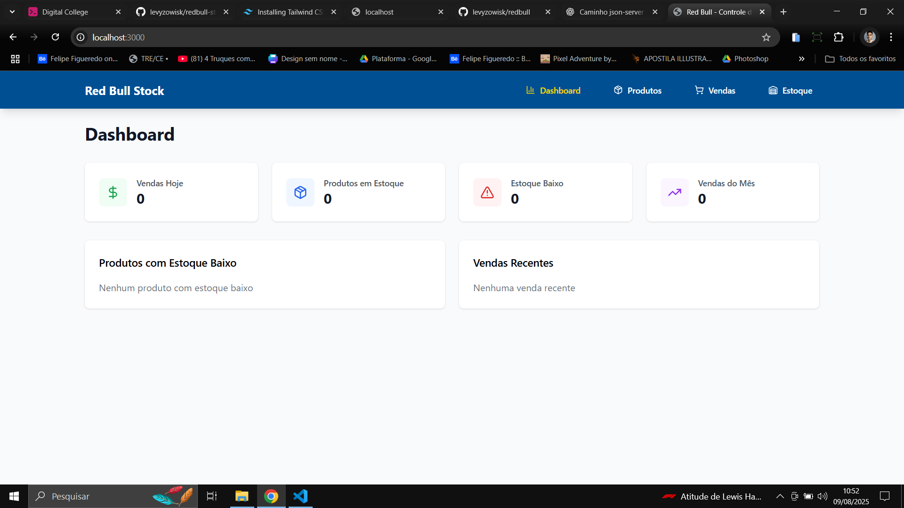
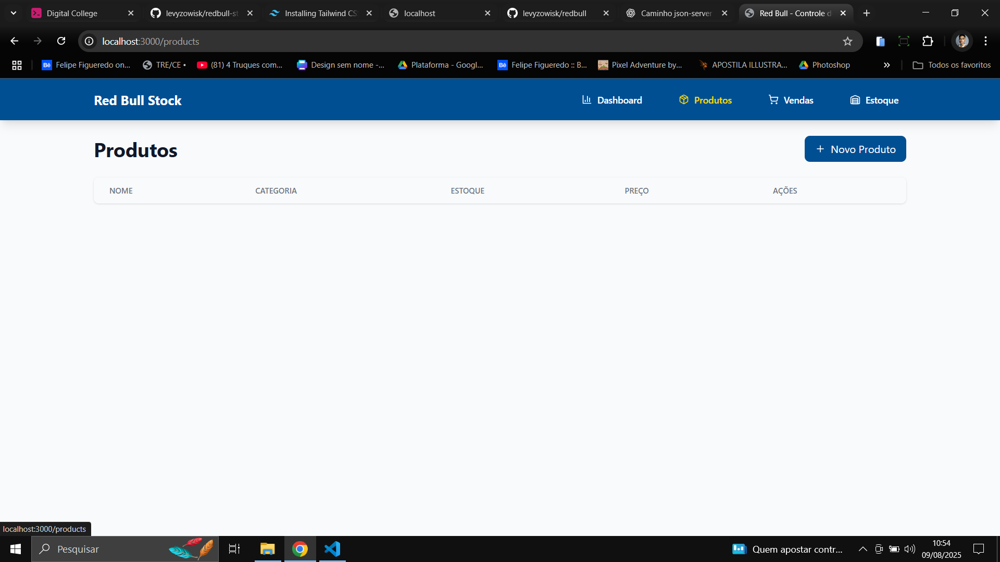
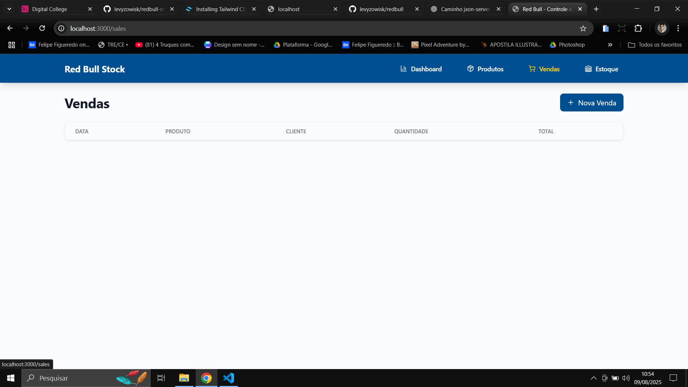
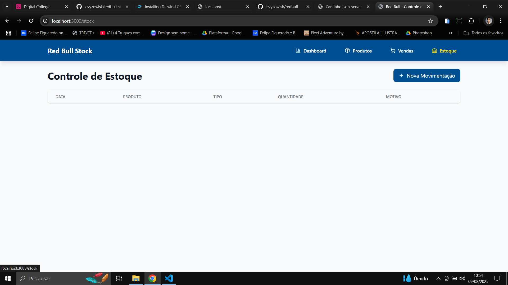
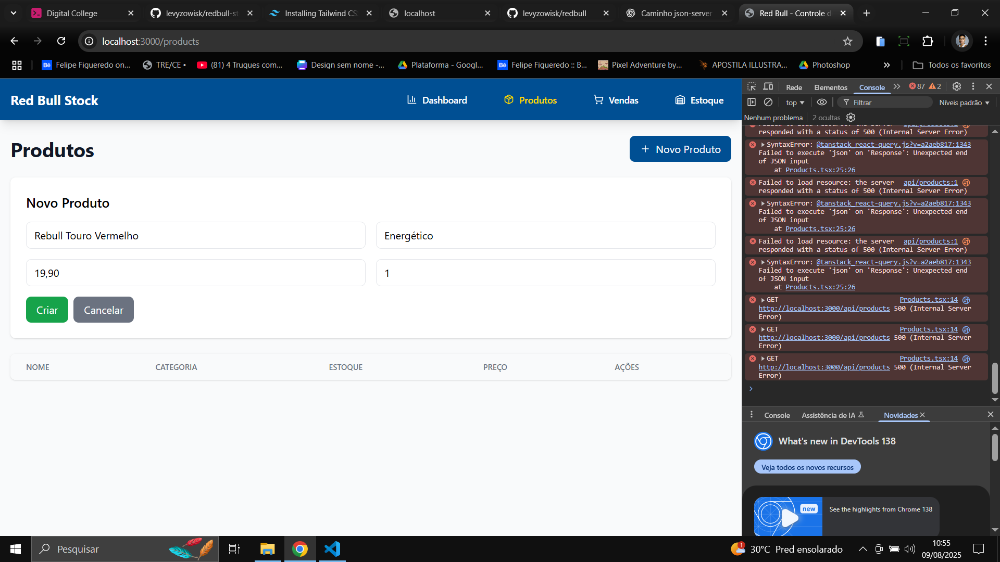

# Red Bull Stock Manager

Sistema de controle de estoque e gerenciamento de vendas para produtos Red Bull.

## 🚀 Tecnologias

### Frontend
- React 18 + TypeScript
- Vite (build tool)
- Tailwind CSS
- React Router DOM
- React Hook Form
- TanStack Query (React Query)
- Lucide React (ícones)

### Backend
- Node.js + Express
- Prisma ORM
- SQLite
- CORS

## 📋 Funcionalidades

- **Dashboard**: Métricas de vendas e estoque

- **Produtos**: CRUD completo de produtos

- **Vendas**: Registro e histórico de vendas

- **Estoque**: Controle de entrada e saída

- **Alertas**: Produtos com estoque baixo


## 🛠️ Instalação

1. **Instalar dependências:**
```bash
npm run install-all
```

2. **Configurar banco de dados:**
```bash
cd server
npm run db:generate
npm run db:migrate
```

3. **Executar aplicação:**
```bash
npm run dev
```

A aplicação estará disponível em:
- Frontend: http://localhost:3000
- Backend: http://localhost:5000

## 📁 Estrutura do Projeto

```
redbull-stock-manager/
├── client/                 # Frontend React
│   ├── src/
│   │   ├── components/     # Componentes reutilizáveis
│   │   ├── pages/         # Páginas da aplicação
│   │   ├── types/         # Tipos TypeScript
│   │   └── hooks/         # Custom hooks
├── server/                # Backend Node.js
│   ├── src/
│   │   └── routes/        # Rotas da API
│   └── prisma/            # Schema do banco
└── package.json           # Scripts principais
```

## 🎨 Cores da Marca

- Azul Red Bull: `#004F93`
- Vermelho: `#DC143C`
- Amarelo: `#FFD700`
- Prata: `#C0C0C0`

## 📊 API Endpoints

### Produtos
- `GET /api/products` - Listar produtos
- `POST /api/products` - Criar produto
- `PUT /api/products/:id` - Atualizar produto
- `DELETE /api/products/:id` - Deletar produto

### Vendas
- `GET /api/sales` - Listar vendas
- `POST /api/sales` - Registrar venda

### Estoque
- `GET /api/stock/movements` - Listar movimentações
- `POST /api/stock/movements` - Registrar movimentação

### Dashboard
- `GET /api/dashboard/stats` - Estatísticas gerais
